# Installation
## Local
### Windows
You can download ollama from [here](https://ollama.com/download)

### Linux
If you are in Linux you can run this command. if you are planning to use the cluster this step is unncessary.  
`curl -fsSL https://ollama.com/install.sh | sh`

## Remote - Cluster 
### 1. Connect to the cluster using SSH.
### 2. Download Ollama  
`curl -L https://ollama.com/download/ollama-linux-amd64.tgz -o ollama-linux-amd64.tgz`
### 3. Create ollama directory
`mkdir ollama`
### 3. Extract the archive:
`tar -xvzf ./ollama-linux-amd64.tgz -C ./ollama`  
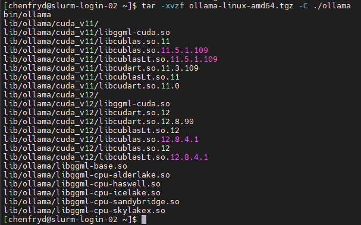
### 4. make sure there are `/lib` and `/bin` directories inside the `/ollama` directory
### 5. check by running `ollama --version` in `/ollama/bin` by running `./ollama --version`  
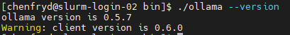
### 6. Create a new diretory called `bin` in the home diretory (`cd ~`)  
`mkdir bin`
### 7. go to `~/bin` by `cd ~/bin`
### 6. Create a symbolic link to the ollama bin.  
This way you can run `ollama` in the terminal.  
`ln -s ~/ollama/bin/ollama ~/bin/ollama`  
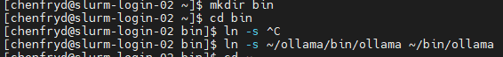
### 7. Make the link command presistent  
`export PATH="$HOME/bin:$PATH"`
### 8. Check the symblic link by running `ollama` in the home directory (`cd ~`)    
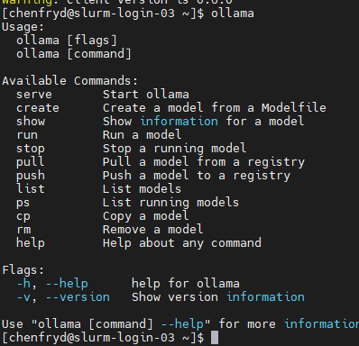
### 9. Upload the `pycharm.sh` file to the cluster. it's located [here](./pycharm.sh).
### 10. give writing premission to the `pycharm.sh` file  
`chmod +x ./pycharm.sh`  
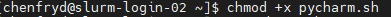

### 11. Create SSH Tunnel
#### 11.1 Click on `Tunnling`  
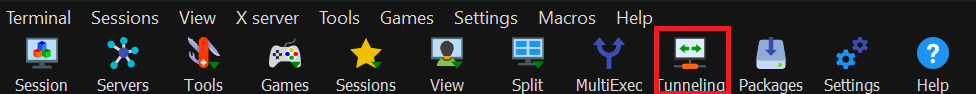

#### 11.2 Click on `New SSH tunnel`  
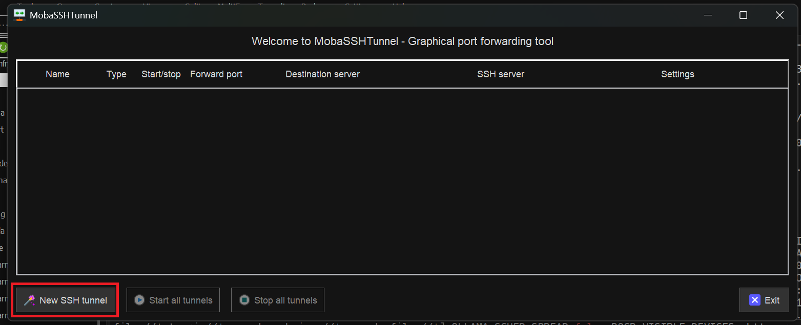

#### 11.3 Enter Details
- Under `<Forwarded port>` enter `11434`
- Under `<SSH server>` enter the ip you recieved from the `./pycharm` file
- Enter in the `<SSH login>` your account name. for example, mine is `chenfryd`.
- in the `<SSH port>` enter `22`
- In the `<Remote server>` enter `localhost`
- and the `<Remote port>` enter `11434`  
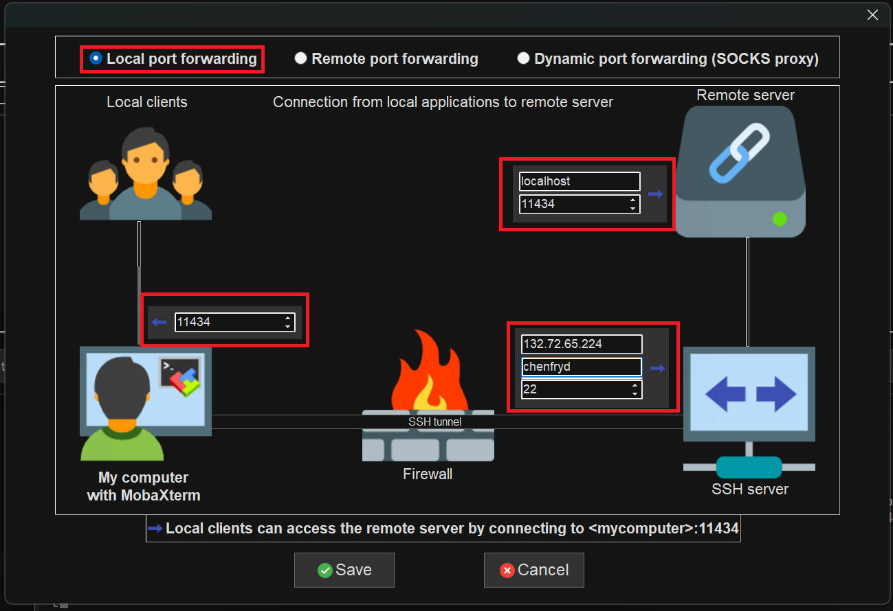

#### 11.4 Start the tunnel
Enter your tunnel name and click on start.  
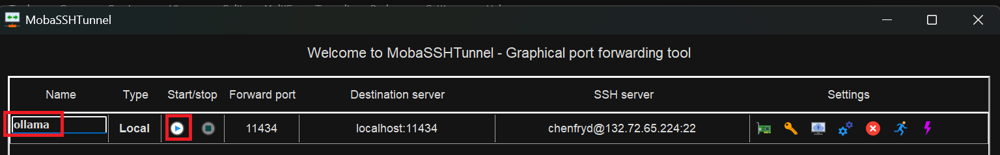

#### 11.5 Check if your can access `localhost:11434` in your browser  
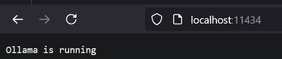 

Keep in mind that if you restart your computer while the SSH tunnel is on, you need to press the start button again to restart it.
# Compitble Models
In order to download a model, run this command `ollama pull <MODEL_NAME>`
for example:
`ollama pull llama3.2:3b`

We must use function calling for cohort, please see compible models [here](https://ollama.com/search?c=tools)

deepseek doesn't support function calling.

# Running
## Remote using cluster
### 1. Make sure you are running on BGU's network
Either by 
- BGU's wifi (`BGU-WIFI` or `eduroam`)
- BGU's LAN (connecting via a wire)
- VPN

### 2. Run the `pycharm.sh` file and copy the ip.  
`./pycharm.sh`  
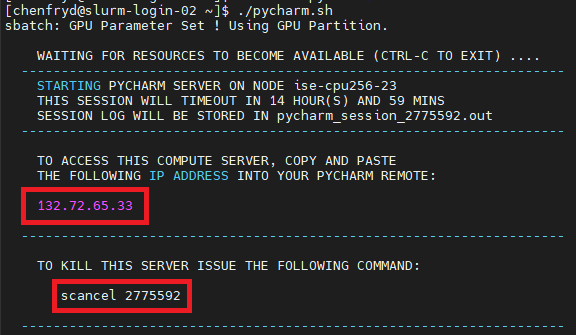

### 3. Create a new SSH connection using the ip.
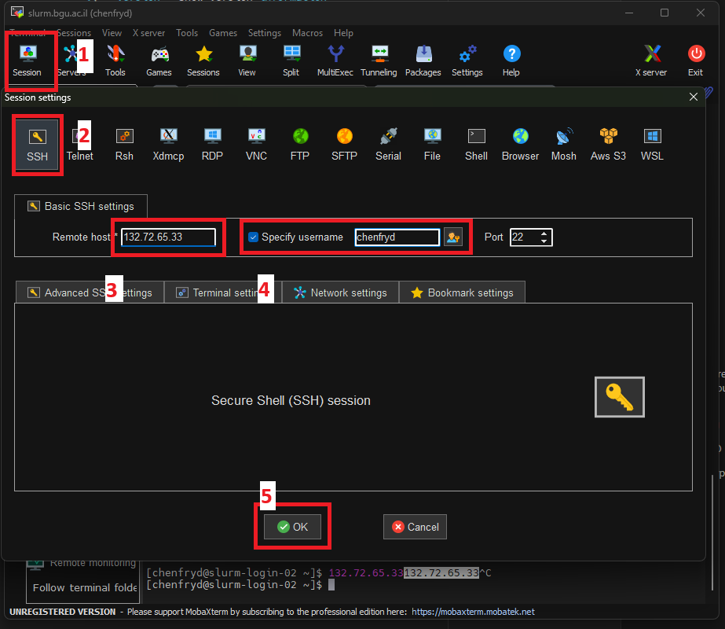

### 4. Serve the Ollama
`ollama serve`  
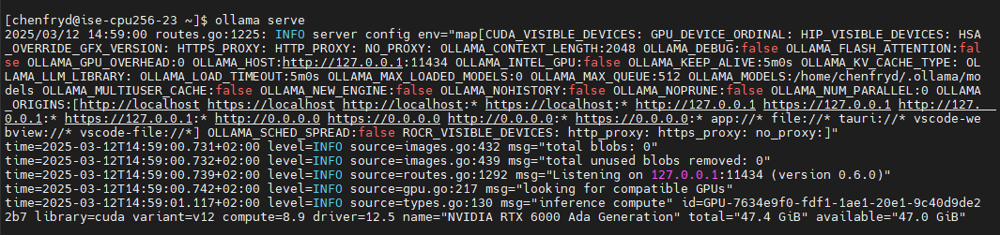

### 5.1 Edit the IP in the SSH tunnel

### 5.2 Click on `Edit this tunnel`
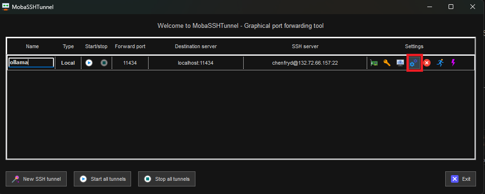

### 5.3 Change the IP
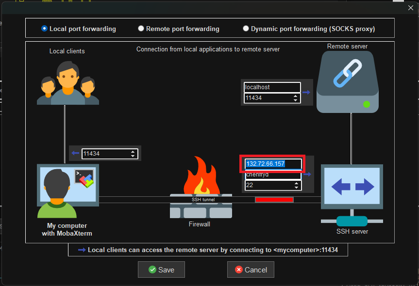

#### 5.5 Check if your can access `localhost:11434` in your browser

# Troubleshooting
## An error occurred: Server disconnected without sending a response.
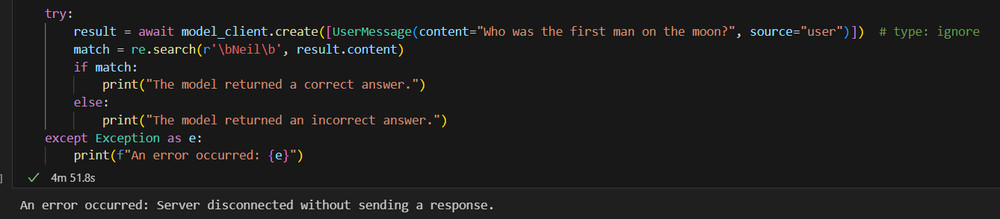  
In the remote serve it's stuck on 
`load_tensors: loading model tensors, this can take a while... (mmap = true)`  
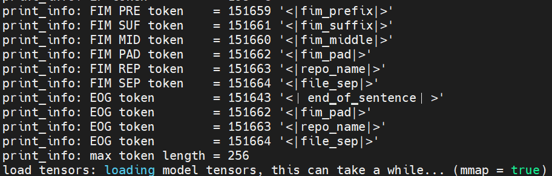  
Just wait until the tensor cores load in the remote server  
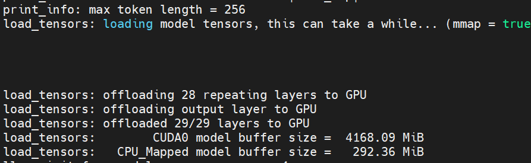  

## Error: could not connect to ollama app, is it running?
According to this [commenter](https://github.com/ollama/ollama/issues/2727#issuecomment-1969331044), all you need to do is just create two terminals. One with `ollama serve` and the other is whatever you want.

## Warning: could not connect to a running Ollama instance
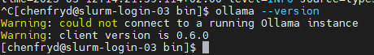  
You need to reinstall ollama according to this [issue](https://github.com/ollama/ollama/issues/7697)

